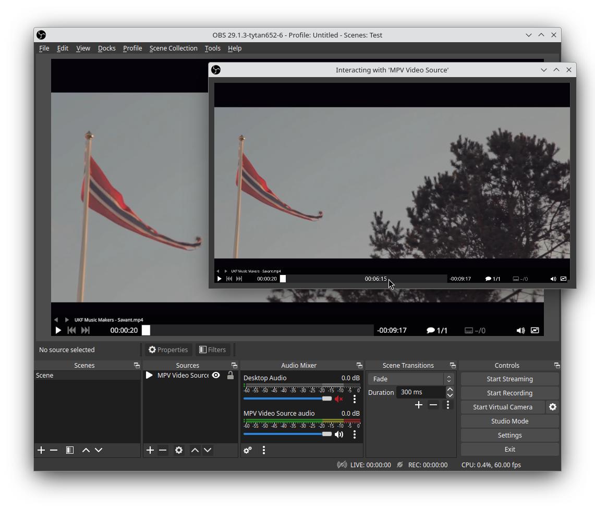

## obs-mpv

Adds a video source for OBS Studio using libmpv.

Things left to fix/address
- Maybe add option to load a custom mpv.conf file and the option to set mpv properties/settings
- Add option to set behavior for player when source is inactive
- Audio control
    - MPV does not seem to offer any way of retrieving raw audio via a callback
        - On linux the source creates a jack audio capture and tells mpv to connect to it
          this works well and allows us to control and filter the audio in obs, however
          it does depend on jack or pipewire working. An option to choose beteween
          the different audio backends (oss, sndio, alsa, pulse, jack and pipewire)
          might be useful.
        - Windows just plays audio through the default audio device
- The interact GUI works only for mouse movements, it does not react to clicks
- Windows can't use Direct3D for rendering and instead copies from OpenGL which is a bit inefficient
